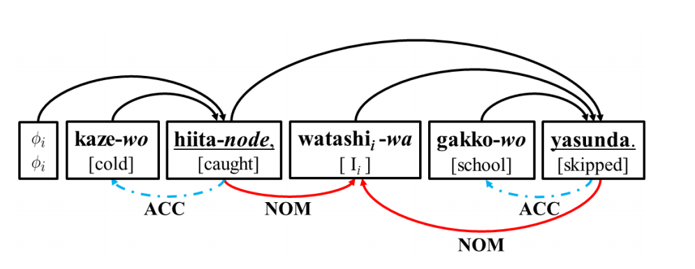

# PASdep

&nbsp;&nbsp;&nbsp;&nbsp;Script for diagramming Japanese sentences with dependency and predicate-argument structures from <a href="https://github.com/yotarow/chapas">ChaPAS</a> output.

&nbsp;&nbsp;&nbsp;&nbsp;I added PAS-related functions by making various modifications to Tetsuo Kiso's <a href="https://github.com/tetsuok/cabocha-to-tikz-deptree">original script</a>.

&nbsp;&nbsp;&nbsp;&nbsp;This is a somewhat slapdash extension, created in 2016 as a means to generate sentence diagrams which can be used as a learning resource to illustrate the agglutinative, post-positional structure of Japanese sentences.

### Description

&nbsp;&nbsp;&nbsp;&nbsp;The script converts the parse results into <a href="http://sourceforge.net/projects/tikz-dependency/" rel="nofollow">TikZ-dependency</a> code, with parameters that implement the LaTeX <a href="http://www.ctan.org/pkg/standalone" rel="nofollow">standalone</a> package. The resulting .tex file can be used to generate transparent PNG diagrams with <a href="https://www.imagemagick.org/script/index.php">ImageMagick</a>, <a href="https://www.ghostscript.com/">GhostScript</a>, and XeLateX.

&nbsp;&nbsp;&nbsp;&nbsp;The arcs over the sentences point from dependent <a href="http://universaldependencies.org/docsv1/ja/overview/introduction.html#bunsetsu-unit-base-phrase"><i>bunsetsu</i></a> units to their heads. The arcs under the sentences indicate predicates and their arguments, with color-coded arrows associated with the nominative, accusative, and dative cases. This scheme is modeled after the paper which inspired my modifications: <a href="http://aclweb.org/anthology/P15-1093">"Joint Case Argument Identification for
Japanese Predicate Argument Structure Analysis"</a> [PDF]

&nbsp;&nbsp;&nbsp;&nbsp;From the paper:

&nbsp;&nbsp;&nbsp;&nbsp;Generated by this script (minus the zero pronoun):

### Execution

&nbsp;&nbsp;&nbsp;&nbsp;By default, the script uses Noto Sans Japanese Regular for Windows. Labels are clearly somewhat arbitrary. Such settings, along with colors, arcs, and boxes, can be customized in the .py file to suit preferences. You may wish to set up a .bat file, such as the one provided, which pipes an input.txt containing the Japanese sentence(s) to ChaPAS (assuming <a href="http://taku910.github.io/cabocha/">CaboCha</a> is installed with <a href="http://taku910.github.io/mecab/">MeCab</a>, selecting UTF-8 options), which in turn sends the results to an output.txt. Python (tested with 3.6+) is used to run this script, which generates a .tex file. Next, the .bat runs XeLaTeX to generate an image as above, along with associated auxiliary files to be deleted (optional).

